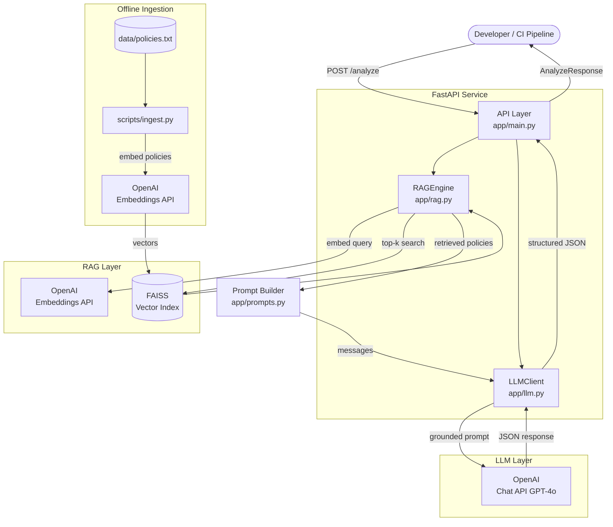

# AI Developer Assistant (RAG-based)

> **A production-grade backend that audits developer code and infrastructure against enterprise security policies using Retrieval-Augmented Generation (RAG).**

[](https://python.org)
[](https://fastapi.tiangolo.com)
[](https://openai.com)
[](https://github.com/facebookresearch/faiss)
[](https://docker.com)

---

## 📋 Problem Statement

Internal developer platforms at large enterprises need automated policy enforcement during development — not just at deployment time. Security teams maintain hundreds of compliance policies, but developers lack instant feedback on whether their Terraform, YAML, or application code violates those policies.

This system solves that problem by:
1. **Storing** all enterprise policies in a semantic vector database (FAISS)
2. **Retrieving** the most relevant policies for any code snippet using embedding similarity
3. **Grounding** an LLM (GPT-4o) on those specific policies to produce structured, auditable feedback
4. **Returning** a deterministic JSON response with violations, security risks, and actionable suggestions

---

## 🏗️ Architecture



### Data Flow

| Step | Component | What happens |
|------|-----------|-------------|
| 0 | `scripts/ingest.py` | Runs once: embeds all policies → builds FAISS index |
| 1 | `POST /analyze` | Client submits code + type |
| 2 | `RAGEngine.retrieve()` | Embeds the code, queries FAISS, returns top-k policies |
| 3 | `build_analysis_prompt()` | Wraps policies + code into a role-based prompt |
| 4 | `LLMClient.analyze()` | Calls GPT-4o with JSON mode, retries on transient errors |
| 5 | `AnalyzeResponse` | Returns structured violations / risks / suggestions |

---

## 🏗️ Architecture Decision: Monolith vs. Split Services

> **This is a critical design decision.** Understanding the trade-offs determines whether you are over-engineering or under-engineering for your use case.

---

### 🟢 Option 1 — Monolith (This Implementation)

```
[ FastAPI Server ]
   ├── API handling        (routing, validation, auth)
   ├── RAG logic           (embedding + FAISS search)
   ├── Prompt building     (grounding + formatting)
   └── LLM call            (OpenAI Chat API)
```

**👉 One server. One process. One deployment.**

This is what we built. All components live inside the same FastAPI application, communicating via in-process function calls with no network overhead.

---

### 🔥 Option 2 — Production Split Services

```
[ API Server ]  ──→  [ RAG Service ]  ──→  [ Vector DB ]
      │
      └──────────→  [ LLM ]
```


Real Use Cases You Can Say 

Code Review Assistant

Input: PR / code

Output: Bugs
Security issues
Performance suggestions

RAG Flow (
User Query:
"Is this API compliant with Citi standards?"

→ Convert to embedding
→ Search vector DB
→ Retrieve policy docs
→ Send to LLM
→ Generate answer

**👉 Multiple services, independently deployable and scalable.**

#### 🟦 API Server — Orchestrator ("Brain / Traffic Controller")
| Responsibility | Detail |
|---|---|
| Accept requests | Expose POST /analyze to clients |
| Validate input | Schema validation, auth, rate limiting |
| Call RAG service | HTTP/gRPC to RAG microservice |
| Call LLM | Forward retrieved policies + code to LLM |
| Return response | Aggregate and return structured JSON |

#### 🟨 RAG Service — Retriever ("Search Engine")
| Responsibility | Detail |
|---|---|
| Embed query | Convert code snippet → embedding vector |
| Search Vector DB | Top-k similarity search in FAISS / Pinecone |
| Return policies | Send relevant policy strings back to API server |

#### 🟥 Vector DB — Memory Storage ("Long-term Memory")
A standalone system (FAISS on disk, Pinecone SaaS, Weaviate, Qdrant) that stores pre-embedded policy vectors and responds to similarity queries.

---

### 🔁 Full Data Flow (Split Services)

```
1. Client        →  API Server       (POST /analyze)
2. API Server    →  RAG Service      (query: code snippet)
3. RAG Service   →  Vector DB       (embed + top-k search)
4. Vector DB     →  RAG Service     (top-k policy vectors)
5. RAG Service   →  API Server      (retrieved policy strings)
6. API Server    →  LLM             (grounded prompt)
7. LLM           →  API Server      (structured JSON)
8. API Server    →  Client          (AnalyzeResponse)
```

---

### 🧠 Why Split? (Benefits of Option 2)

| Benefit | Explanation |
|---------|-------------|
| **Scalability** | Embedding + vector search is CPU/memory heavy — scale the RAG service independently without touching the API server |
| **Reusability** | Multiple services (code linter, doc generator, PR reviewer) can all call the same RAG service |
| **Cleaner separation** | Each service has one job — easier to test, debug, and deploy |
| **Independent performance tuning** | Optimise retrieval latency separately from LLM latency |
| **Fault isolation** | A RAG service crash doesn't take down the entire API |

---

### ⚠️ When NOT to Split (Stay Monolith)

> **Interview insight:** Don't over-engineer. Microservices add real operational cost.

Keep it a **single service** when:

- ✅ Small system or low traffic (< 100 req/day)
- ✅ POC, MVP, or internal tool
- ✅ Team size is small (1–3 engineers)
- ✅ You don't need to scale components independently
- ✅ Simplicity and fast iteration matter more than optimal scaling

Split into **separate services** when:

- ✅ RAG retrieval is a bottleneck and needs independent scaling
- ✅ Multiple products share the same policy retrieval logic
- ✅ You need independent deployments (e.g., RAG updates without API redeploy)
- ✅ SLAs require fault isolation between retrieval and serving layers

**This project uses the Monolith architecture** — the right choice for an internal developer tool at this scale. The code is structured so that `rag.py`, `llm.py`, and `main.py` can be extracted into separate services with minimal refactoring.

---


### Prerequisites

- Python 3.11+
- Docker & Docker Compose (for containerised setup)
- An [OpenAI API key](https://platform.openai.com/api-keys)

---

### Option A: Local (without Docker)

```bash
# 1. Clone and enter the project
git clone <repo-url>
cd ai-dev-assistant-rag

# 2. Create a virtual environment
python -m venv .venv
source .venv/bin/activate          # Windows: .venv\Scripts\activate

# 3. Install dependencies
pip install -r requirements.txt

# 4. Configure environment
cp .env.example .env
# Open .env and set OPENAI_API_KEY=sk-...

# 5. Build the FAISS policy index (one-time setup)
python scripts/ingest.py

# 6. Start the API server
uvicorn app.main:app --reload --port 8000
```

Visit [http://localhost:8000/docs](http://localhost:8000/docs) for the interactive API documentation.

---

### Option B: Docker Compose (recommended)

```bash
# 1. Configure environment
cp .env.example .env
# Edit .env — set OPENAI_API_KEY=sk-...

# 2. Build the image and start services
#    The `ingest` service runs first to build the FAISS index,
#    then the `api` service starts automatically.
docker compose up --build

# 3. In a separate terminal, test the API
curl http://localhost:8000/health
```

---

## 📡 API Reference

### `POST /analyze`

Analyze code or infrastructure against enterprise security policies.

**Request**

```json
{
  "code": "string",
  "type": "terraform | yaml | code"
}
```

**Response**

```json
{
  "analysis": {
    "violations": ["string"],
    "security_risks": ["string"],
    "suggestions": ["string"]
  }
}
```

**Error Responses**

| HTTP Status | `error_code` | Cause |
|-------------|-------------|-------|
| 400 | `EMPTY_QUERY` | Blank or whitespace-only code |
| 422 | `VALIDATION_ERROR` | Missing / invalid request fields |
| 502 | `LLM_ERROR` | OpenAI Chat API failure after retries |
| 502 | `EMBEDDING_ERROR` | OpenAI Embeddings API failure |
| 503 | `INDEX_NOT_FOUND` | FAISS index not built yet |
| 500 | `INTERNAL_ERROR` | Unexpected server error |

---

### Example `curl` Requests

**Terraform — public S3 bucket**

```bash
curl -X POST http://localhost:8000/analyze \
  -H "Content-Type: application/json" \
  -d '{
    "code": "resource \"aws_s3_bucket\" \"data\" {\n  bucket = \"my-company-data\"\n  acl    = \"public-read\"\n}",
    "type": "terraform"
  }'
```

**Application code — hardcoded secret**

```bash
curl -X POST http://localhost:8000/analyze \
  -H "Content-Type: application/json" \
  -d '{
    "code": "DB_PASSWORD = \"MySuperSecretP@ss123\"\napi_key = \"sk-prod-abc123xyz\"",
    "type": "code"
  }'
```

**YAML — no resource limits**

```bash
curl -X POST http://localhost:8000/analyze \
  -H "Content-Type: application/json" \
  -d '{
    "code": "apiVersion: v1\nkind: Pod\nspec:\n  containers:\n  - name: app\n    image: ubuntu:latest\n    securityContext:\n      privileged: true",
    "type": "yaml"
  }'
```

**Health check**

```bash
curl http://localhost:8000/health
# {"status":"ok","version":"1.0.0"}
```

---

### `GET /health`

Liveness probe. Returns `200 OK` when the service is running.

```json
{"status": "ok", "version": "1.0.0"}
```

---

### 📁 Project Structure

```bash
.
├── app/
│   ├── api/            # Route handlers & dependencies
│   │   ├── dependencies.py
│   │   └── routes.py
│   ├── core/           # Config & global exceptions
│   │   ├── config.py
│   │   └── exceptions.py
│   ├── engines/        # FAISS (RAG) & OpenAI (LLM) implementations
│   │   ├── llm.py
│   │   └── rag.py
│   ├── models/         # Pydantic data schemas
│   │   ├── analysis.py
│   │   └── base.py
│   ├── prompts/        # Prompt templates & builders
│   │   └── analysis.py
│   ├── services/       # AnalyzerService (Orchestrator)
│   │   └── analyzer.py
│   └── main.py         # App factory & entry point
├── data/               # Vector DB & policy source
├── scripts/            # Ingestion & CLI tools
├── .env.example        # Environment variable template
├── Dockerfile          # Multi-stage production image
└── docker-compose.yml  # Local dev + Ingest service
```

---

## ⚙️ Configuration Reference

All configuration is via environment variables (or `.env`).

| Variable | Default | Required | Description |
|----------|---------|----------|-------------|
| `OPENAI_API_KEY` | — | ✅ | OpenAI API key |
| `EMBEDDING_MODEL` | `text-embedding-3-small` | | Embedding model |
| `CHAT_MODEL` | `gpt-4o` | | Chat model |
| `TOP_K` | `5` | | Policies retrieved per query |
| `FAISS_INDEX_PATH` | `./data/faiss_index` | | FAISS index directory |
| `POLICIES_FILE_PATH` | `./data/policies.txt` | | Raw policies path |
| `LLM_TEMPERATURE` | `0.1` | | LLM sampling temp (0=deterministic) |
| `LLM_MAX_TOKENS` | `1024` | | Max LLM output tokens |
| `LLM_TIMEOUT_SECONDS` | `30` | | LLM HTTP timeout |
| `LLM_MAX_RETRIES` | `3` | | Max retries for transient errors |
| `LOG_LEVEL` | `INFO` | | Logging level |
| `ENVIRONMENT` | `development` | | deployment, staging, production |

---

## 🎨 Design Decisions

### 1. FAISS `IndexFlatL2` (Exact Search)
For a policy corpus of ~100 entries, exact nearest-neighbour search is both fast and accurate. `IndexFlatL2` requires no training phase and guarantees exact results. For corpora >100k entries, consider `IndexIVFFlat` with a trained quantiser.

### 2. Async-first Architecture
The entire request pipeline is async (`AsyncOpenAI`, `async def` endpoints). FAISS search is CPU-bound and synchronous but fast enough at this scale to not block the event loop. For very large indices, it can be wrapped in `asyncio.run_in_executor`.

### 3. JSON Mode + Low Temperature
GPT-4o is called with `response_format={"type": "json_object"}` (API-level JSON enforcement) **and** prompt-level instructions for JSON-only output. Temperature `0.1` ensures near-deterministic, reproducible analysis.

### 4. Clean Dependency Injection via `app.state`
`RAGEngine` and `LLMClient` are instantiated once in the FastAPI lifespan and attached to `app.state`. Handlers receive them via `request.app.state`. This avoids global variables and makes testing trivial — tests simply swap `app.state` members.

### 5. Graceful Startup Failure
If the FAISS index is missing at startup, the app still starts (it does not crash). The `/analyze` endpoint returns `503 Service Unavailable` with a clear message. This allows health checks to pass while operators rebuild the index without a full redeploy.

### 6. Tenacity Retry Strategy
Only _transient_ errors (`RateLimitError`, `APIConnectionError`) are retried. `4xx` client errors (bad API key, invalid model) immediately surface as `LLMError` — retrying them would waste time and quota.

---

## ⚖️ Trade-offs

| Decision | Trade-off |
|----------|-----------|
| FAISS (in-process) | No network hop, but not horizontally scalable across workers without external storage |
| `IndexFlatL2` | Exact results, but O(n) search — fine for <100k vectors |
| Single FAISS index file on disk | Simple, but requires re-running `ingest.py` on every policy update |
| `AsyncOpenAI` | Non-blocking I/O, but FAISS search is still synchronous |
| No auth on API | Intentional simplification — deploy behind an API Gateway / service mesh in production |

---

## 🚀 Future Improvements

- **Caching layer**: Add Redis to cache embedding results for repeated code queries (structure is already Redis-ready via the `Settings` model).
- **FAISS IVF index**: Use `IndexIVFFlat` for approximate search at scale, enabling corpora of millions of policies.
- **Hot-reload of policies**: Watch `policies.txt` for changes and rebuild the index without restarting the service.
- **Authentication**: Add an API key or JWT-based auth middleware for multi-tenant deployments.
- **Streaming responses**: Use Server-Sent Events (SSE) or WebSockets for real-time analysis feedback in IDE plugins.
- **Policy versioning**: Store policies in a database with versioning so auditors can trace which policy version flagged an issue.
- **Feedback loop**: Collect accept/reject signals on suggestions and fine-tune the prompt or model over time.
- **CI/CD integration**: Publish a GitHub Action and Jenkins plugin that call `/analyze` on every PR.

---

## 🧪 Demo Output & Validation Results

Run the offline demo (no API key required):

```bash
source .venv/bin/activate
python demo_mock.py
```

### Scenario Results

| # | Type | Description | Violations | Risks | Status |
|---|------|-------------|:----------:|:-----:|:------:|
| 1 | Terraform | Public S3 bucket + No encryption | 5 | 3 | ❌ |
| 2 | Terraform | Hardcoded secrets + Wildcard IAM + AdminAccess | 5 | 4 | ❌ |
| 3 | Terraform | SSH/RDP open to 0.0.0.0/0 + HTTP listener | 3 | 3 | ❌ |
| 4 | YAML | Kubernetes: privileged pod + hardcoded secrets + no limits | 5 | 4 | ❌ |
| 5 | YAML | GitHub Actions: secrets echoed to logs + HTTP deploy | 3 | 3 | ❌ |
| 6 | Code | Python: hardcoded AWS creds + SQL injection + no auth | 4 | 4 | ❌ |
| 7 | Terraform | Well-written compliant S3 config | 0 | 0 | ✅ |
| | | **Total** | **25** | **21** | **7/7 ran** |

---

### Sample: Scenario #1 — Public S3 Bucket (Terraform)

<details>
<summary>Show full response</summary>

```json
{
    "analysis": {
        "violations": [
            "S3 bucket 'company_data' has ACL set to 'public-read', violating the policy that S3 buckets must never be configured with public ACLs.",
            "S3 bucket does not have Block Public Access settings enabled, violating the policy requiring it on every bucket.",
            "S3 bucket versioning is not enabled, violating the policy requiring versioning on all buckets storing critical data.",
            "S3 bucket server-side encryption is not configured, violating the policy requiring encryption at rest for all object stores.",
            "Mandatory resource tags (Environment, Owner, CostCenter, Project, ManagedBy) are missing or incomplete."
        ],
        "security_risks": [
            "Public read ACL exposes all bucket objects to the internet, which may leak sensitive customer data.",
            "Without versioning, accidental deletions or ransomware attacks cannot be recovered from.",
            "Unencrypted storage leaves data at rest vulnerable to unauthorised access if the storage layer is compromised."
        ],
        "suggestions": [
            "Remove the 'acl = public-read' attribute and enable 'aws_s3_bucket_public_access_block' with all four block settings set to true.",
            "Add an 'aws_s3_bucket_server_side_encryption_configuration' resource using 'aws:kms' with a CMK.",
            "Add an 'aws_s3_bucket_versioning' resource with status = 'Enabled'.",
            "Add all mandatory tags: Environment, Owner, CostCenter, Project, ManagedBy."
        ]
    }
}
```

</details>

---

### Sample: Scenario #6 — Python Code (SQL injection + hardcoded creds)

<details>
<summary>Show full response</summary>

```json
{
    "analysis": {
        "violations": [
            "AWS_KEY and AWS_SECRET are hardcoded as module-level variables, violating the policy prohibiting hardcoded secrets in source code.",
            "DB_PASSWORD and API_SECRET are hardcoded as plain-text string literals.",
            "The 'admin_endpoint()' function has no authentication check, violating the policy requiring authentication on all API endpoints.",
            "External API call uses 'http://' instead of 'https://', violating the HTTPS enforcement policy."
        ],
        "security_risks": [
            "Hardcoded AWS credentials (AKIA*) are detected by automated scanners and can be exploited immediately if the repository is public.",
            "SQL injection in 'get_user()' allows an attacker to exfiltrate all user records or drop tables.",
            "Unauthenticated 'admin_endpoint()' exposes the full user list and the API secret to any caller.",
            "HTTP API calls can be intercepted on the network, exposing request bodies and the Bearer token."
        ],
        "suggestions": [
            "Move all credentials to environment variables or AWS Secrets Manager; load at runtime.",
            "Rewrite 'get_user()' using parameterised queries: cur.execute('SELECT * FROM users WHERE username = ?', (username,)).",
            "Add an authentication decorator or middleware to 'admin_endpoint()' that validates a JWT or API key.",
            "Replace 'http://api.service.com' with 'https://api.service.com'."
        ]
    }
}
```

</details>

---

### Sample: Scenario #7 — Clean Terraform (No Violations)

<details>
<summary>Show full response</summary>

```json
{
    "analysis": {
        "violations": [],
        "security_risks": [],
        "suggestions": [
            "Consider adding MFA Delete to the 'aws_s3_bucket_versioning' configuration to prevent bulk deletion of versioned objects.",
            "Ensure the 'var.access_log_bucket_id' target bucket also has Block Public Access enabled.",
            "Pin the Terraform AWS provider version (e.g., 'version = \"~> 5.0\"') to prevent unexpected provider upgrades."
        ]
    }
}
```

</details>

---

### Full Demo Summary (printed by `demo_mock.py`)

```
═══════════════════════════════════════════════════════════════════════
  DEMO SUMMARY
═══════════════════════════════════════════════════════════════════════

  Scenarios run          : 7
  Successful             : 7
  Total violations       : 25
  Total security risks   : 21
  Total time             : 0.33s

  Per-Scenario Breakdown
  ──────────────────────────────────────────────────────────────────────
  ❌  Scenario #1   Violations: 5    Risks: 3    (0.33s)
  ❌  Scenario #2   Violations: 5    Risks: 4    (0.00s)
  ❌  Scenario #3   Violations: 3    Risks: 3    (0.00s)
  ❌  Scenario #4   Violations: 5    Risks: 4    (0.00s)
  ❌  Scenario #5   Violations: 3    Risks: 3    (0.00s)
  ❌  Scenario #6   Violations: 4    Risks: 4    (0.00s)
  ✅  Scenario #7   Violations: 0    Risks: 0    (0.00s)
```

> **Note:** Scenario #7 (clean, well-written Terraform) correctly returns zero violations and zero security risks — demonstrating the system does not produce false positives on compliant code.

---

## 🔒 Security Notes

- **Never commit `.env`** — it is in `.gitignore`.
- The Docker image runs as a non-root user (`appuser`, UID 1001).
- No secrets are baked into the image — all injected at runtime via env vars.
- The `/analyze` endpoint should be placed behind an authenticated API Gateway or service mesh in production.

---

## 📄 License

MIT — See [LICENSE](LICENSE) for details.
